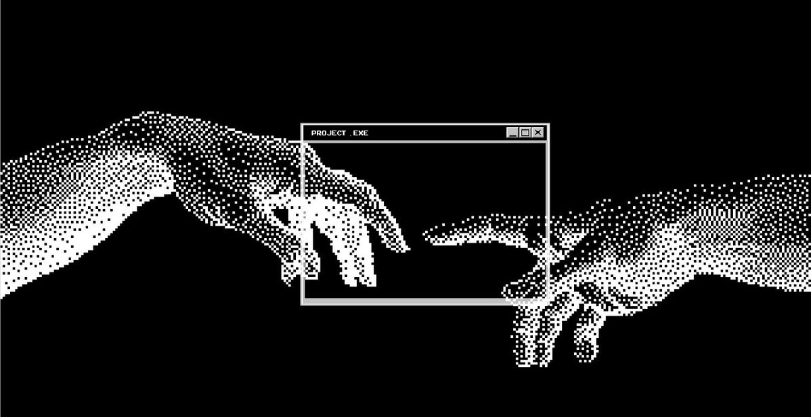

# GustavoDruciak

## 👨‍💻 Sobre Mim

Olá, me chamo Gustavo Druciak.

🎓 Cursando Análise e Desenvolvimento de Sistemas (UNIFACEAR), previsão de conclusão em 2028.

💻 Estudando Java, SQL, JavaScript, HTML e CSS.

🔐 Estudando cibersegurança por conta própria, com foco em Red Team.

🚀 No caminho para me tornar um profissional na área.

🎯 Meu objetivo: conseguir minha primeira oportunidade em T.I., com foco em segurança da informação.

## 🚀 Tecnologias

## 📚 Estudando Agora

- Java (JDBC, Hibernate e Maven)
- SQL e bancos de dados relacionais
- JavaScript, HTML e CSS
- Arquitetura de software
- Fundamentos de cibersegurança e Red Team

## 📂 Projetos

### 🎓 Projetos Feitos na Faculdade

<!--
Quando subir um projeto, copie o modelo abaixo, tire os comentários e preencha:

- **[Nome do projeto](link-do-repositorio)**: uma frase dizendo o que ele faz. Tecnologias: Java, JDBC, MySQL.
-->

*Em breve: projetos em Java e SQL.*

### 🔐 Estudos de Segurança

<!--
Quando tiver algo, adicione aqui. Exemplos:

- **[Anotações TryHackMe](link)**: resumo das salas e técnicas que aprendi.
- **[Write-ups](link)**: como resolvi máquinas e desafios (CTFs).
- **[Home lab](link)**: como montei meu laboratório de testes.
-->

*Em breve: anotações e write-ups dos meus estudos.*

## 🌎 Sociais

<!--
Quando criar o LinkedIn, tire os comentários e coloque seu link:

-->
